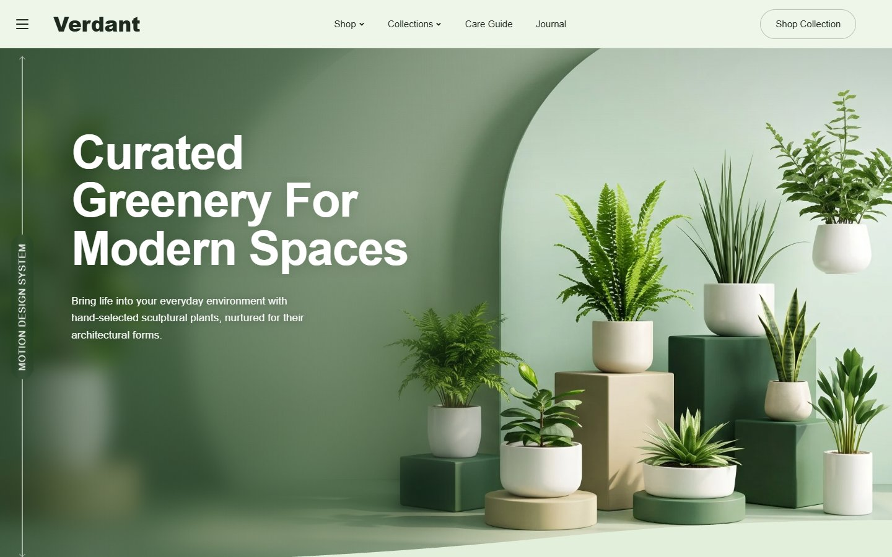
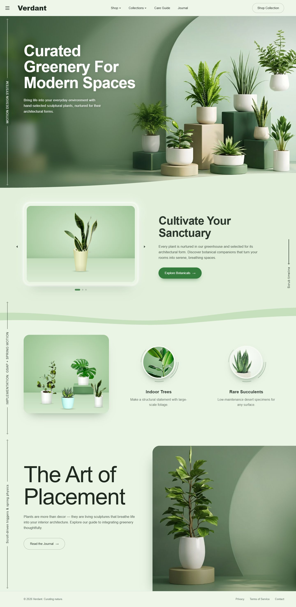
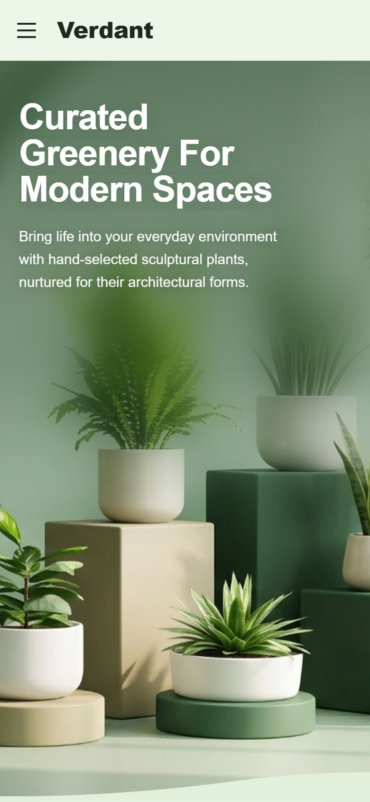

<div align="center">

# 🌿 Verdant — Tree Plantation Landing Page

**A motion-rich, fully responsive landing page for a sculptural plant shop.**

Split-text reveals · scroll-driven parallax · spring-physics hovers · a dotted path that draws as you scroll

[](https://saidur289.github.io/tree-plantation-landing-page/animated.html)
[](https://gsap.com/)
[](#)
[](#)
[](https://pptr.dev/)

<br>



</div>

---

## 📑 Table of Contents

- [Live Demo](#-live-demo)
- [Screenshots](#-screenshots)
- [Features](#-features)
- [Tech Stack](#-tech-stack)
- [Getting Started](#-getting-started)
- [Scripts](#-scripts)
- [Project Structure](#-project-structure)
- [Deployment](#-deployment)
- [Credits](#-credits)

---

## 🚀 Live Demo

| Page | Link |
|---|---|
| ✨ Animated site (main) | **https://saidur289.github.io/tree-plantation-landing-page/animated.html** |
| 📄 Static version | https://saidur289.github.io/tree-plantation-landing-page/ |

---

## 📸 Screenshots

<table>
  <tr>
    <th width="68%">🖥️ Desktop — full page</th>
    <th width="32%">📱 Mobile</th>
  </tr>
  <tr>
    <td valign="top"></td>
    <td valign="top"></td>
  </tr>
</table>

---

## ✨ Features

### 🎬 Motion design
- **Split-text headline** — characters rise in line by line, never breaking mid-word
- **Focus-pull hero** — the studio photo zooms out of a soft blur on load, then softens again as you scroll away
- **Scroll parallax** — photos, waves, and plants move at different speeds via GSAP ScrollTrigger
- **Spring-physics hover** — plants lean toward the cursor in 3D and swing when brushed
- **Self-drawing path** — a dotted trail draws across the page, scrubbed to scroll position
- **Micro-interactions** — orbiting arcs speed up on hover, thumbnails squash-and-bounce on press, elastic carousel

### 📱 Responsive & accessible
- Tested on **10 viewports** — 320px phones, landscape phones, tablets, laptops, Full HD, and 4K
- Touch-friendly navigation: tap-to-open dropdowns and a slide-out menu (closes with <kbd>Esc</kbd>)
- Respects **`prefers-reduced-motion`**
- Content stays visible even if the animation library fails to load
- Semantic markup, alt text on all images, live-region announcements for the carousel

### ⚡ Performance
- WebP images with transparent plant cutouts
- System font (Arial), so there's no web-font download
- Animations pause off-screen

---

## 🛠️ Tech Stack

| Layer | Tools |
|---|---|
| Markup & styles | HTML5, CSS3 (container query units, CSS masks, custom properties) |
| Animation | [GSAP 3](https://gsap.com/) + ScrollTrigger, custom spring physics in vanilla JS |
| Static version | [Tailwind CSS](https://tailwindcss.com/) (CDN) |
| Tooling | [Node.js](https://nodejs.org/), [Puppeteer](https://pptr.dev/) for visual QA |
| Hosting | GitHub Pages |

---

## 🏁 Getting Started

**Prerequisites:** [Node.js](https://nodejs.org/) 18+

```bash
# 1. Clone the repo
git clone https://github.com/Saidur289/tree-plantation-landing-page.git
cd tree-plantation-landing-page

# 2. Install dev dependencies (Puppeteer, for the QA scripts)
npm install

# 3. Start the local server
npm start
```

Open **http://localhost:8080/** in your browser.

> 💡 The site itself has no build step. Any static server works, and `npm start` runs a tiny dependency-free one (`serve.js`).

---

## 📜 Scripts

| Command | Description |
|---|---|
| `npm start` | Serve the project at `http://localhost:8080` |
| `npm run compare` | Render the site beside the design mockup → `compare.png` |
| `npm run responsive` | Screenshot 10 device sizes into `screenshots/responsive/` and flag horizontal overflow |
| `node screenshot-animated.js` | Full-page capture of the animated site (needs `npm start`) |

---

## 📁 Project Structure

```
tree-plantation-landing-page/
├── animated.html          # Main animated landing page
├── index.html             # Static Tailwind version
├── images/
│   ├── hero-studio.webp   # Hero + placement panel photo
│   ├── cutouts/           # Transparent plant cutouts (WebP)
│   └── *.jpg              # Supporting photography
├── design/
│   └── mockup.jpg         # Original design reference
├── docs/                  # README screenshots
├── serve.js               # Zero-dependency static server
├── compare.js             # Mockup vs. site visual diff
├── responsive.js          # Multi-device screenshot audit
└── screenshot*.js         # Full-page capture scripts
```

---

## 🌐 Deployment

The site is served by **GitHub Pages** from the `gh-pages` branch. To publish the latest `main`:

```bash
git push origin main:gh-pages
```

---

## 🙏 Credits

- Hero studio image and design mockup were supplied for this project
- Plant photography from [Unsplash](https://unsplash.com/); the plant cutouts were made from Unsplash photos
- Animation powered by [GSAP](https://gsap.com/)

---

<div align="center">

Made with 🌱 by [Saidur289](https://github.com/Saidur289)

⭐ If you like this project, give it a star!

</div>
